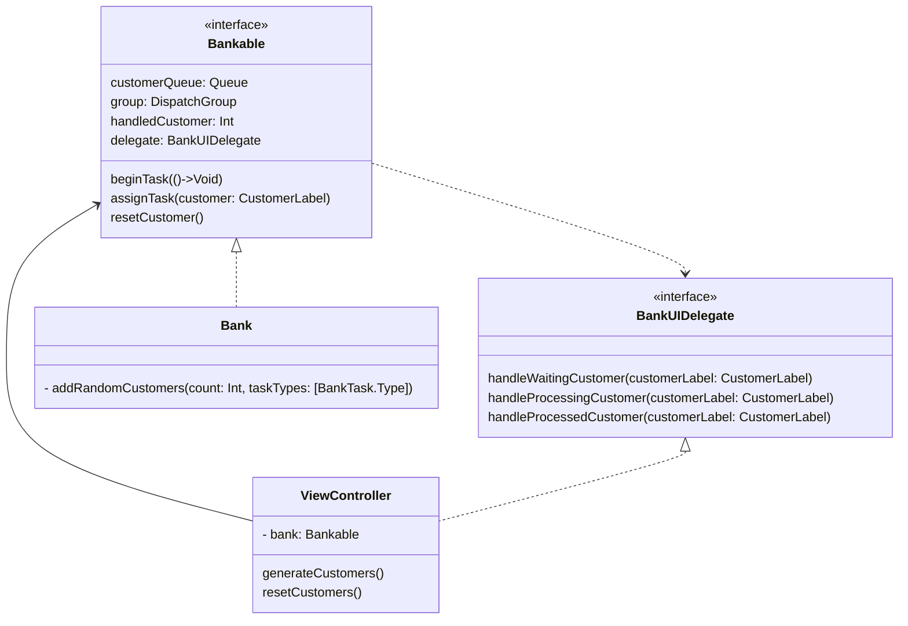

### 프로젝트 참여자

| 뉴준성 | 하워드 |
| --- | --- |
|  |  |

### 프로젝트 소개

- 은행창구를 만들어 대출, 입출금 고객을 Concurrent programming을 통해서 처리하고 UI에 반영해주는 앱을 만들었습니다.

### 프로젝트 동작 화면
| 콘솔앱 | UI앱 |
| --- | --- |
|||

### 구현 내용

- STEP1
    - Queue 타입의 Linked-List 모델 구현
    - Generic 타입 활용
    - Unit Test 적용
- STEP2
    - 은행 업무 처리 콘솔앱 구현
- STEP3
    - DispatchQueue를 활용하여 은행 업무처리 구분 및 async 적용
- STEP4
    - UIView 코드 작성 , Autolayout 코드 적용
    - main queue, global queue UI처리 및 비지니스 로직 분리
    - Timer 구현

### UML

### 프로젝트를 통해 배운것 및 느낀점

- 뉴진스
    - 내가 최고야 ㅇㅈ
- 하워드
    - GCD를 활용하여 동시성 프로그래밍 대해 기본적인것을 학습할 수 있었습니다.
    - UI와, Constraint를 코드로 작성하여 Autolayout을 적용시키는 법을 배웠습니다.
    - main thread에서 처리해야할 일과 global에서 처리해야할일의 차이, semaphore의 활용등을 배웠습니다.
    - protocol을 활용하여 SOLID 규칙을 지키려고 노력해보았고, 어떻게 해야 할 지 방향을 잡을 수 있게 된것같습니다.
    - 아직 완벽하게 동시성 프로그래밍과 관련하여 이해가 되지 않은 것 같아서, 이 부분에 대한것과 protocol과 completionHandler의 사용법에 대해서 조금 더 학습을 진행해야겠다고 생각했습니다.
 

### 참고내용

- 공식문서
    - [Closure](https://docs.swift.org/swift-book/documentation/the-swift-programming-language/closures/)
    - [Inheritance](https://docs.swift.org/swift-book/documentation/the-swift-programming-language/closures/)
    - [Generics](https://docs.swift.org/swift-book/documentation/the-swift-programming-language/generics/)
    - [Subscripts](https://docs.swift.org/swift-book/documentation/the-swift-programming-language/subscripts/)
    - [Concurrency](https://developer.apple.com/library/archive/documentation/General/Conceptual/ConcurrencyProgrammingGuide/Introduction/Introduction.html)
- WWDC
    - [GCD](https://developer.apple.com/videos/play/wwdc2016/720/)
- 기타 강의
    - [Autolayout](https://yagom.net/courses/autolayout/)

